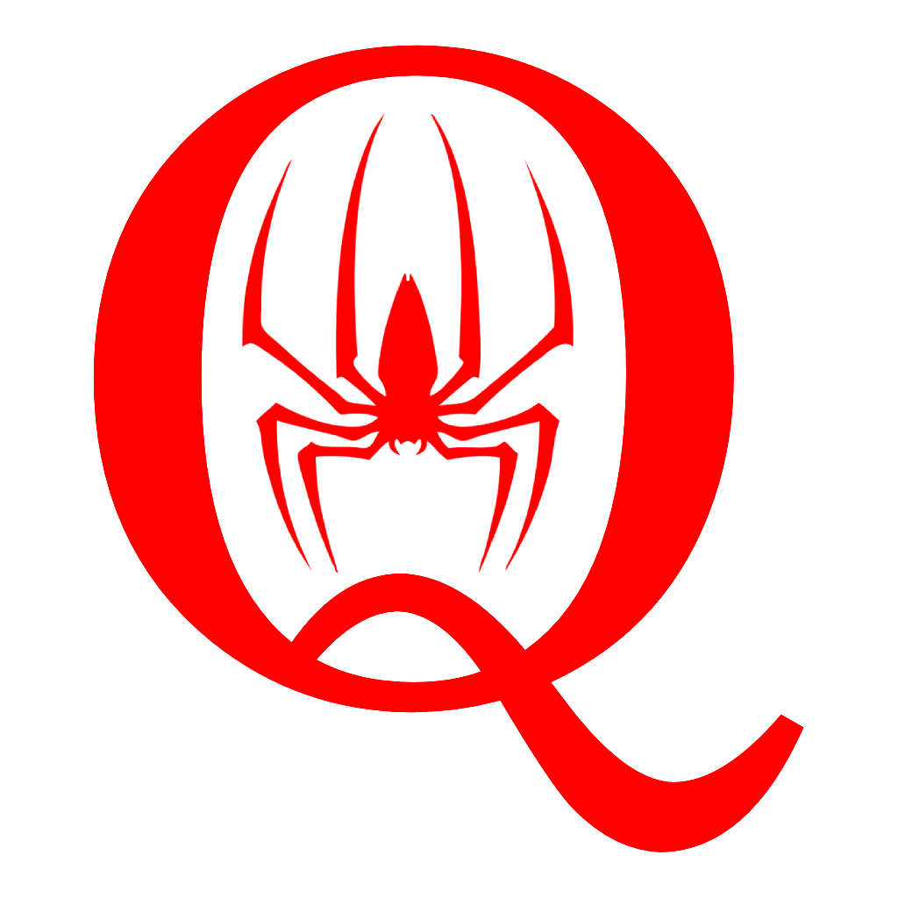

<div align="center">
  <h1>qSpider</h1>
  <br/>
  Web and desktop player for QSP
</div>

<hr />

[](https://opensource.org/licenses/MIT)
[](http://makeapullrequest.com)
[](http://commitizen.github.io/cz-cli/)
[](https://github.com/prettier/prettier)

# Qspider

## Development server

Run `npm start` for a dev server. Navigate to http://localhost:4200/. The app will automatically reload if you change any of the source files.

## Build

Run `nx build player` to build the project. The build artifacts will be stored in the `dist/` directory. Use the `--prod` flag for a production build.

## Running on desktop

To run desktop version of qSpider you need [Rust](https://rustup.rs/) installed on your machine.
Once you have it

```sh
cd ./src-tauri
cargo install
cd ..
```

To run desktop player in development mode run `npm run start:desktop`.
